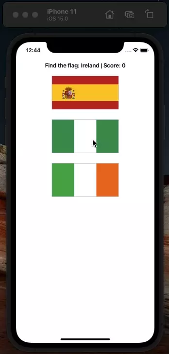

# GuessTheFlag
A game to guess the correct flag of the country.

This is my second swift project and it is a part of the series [100 Days of Swift](https://www.hackingwithswift.com/100/), from [HackingWithSwift.com](https://www.hackingwithswift.com)

## Preview (.webp)

